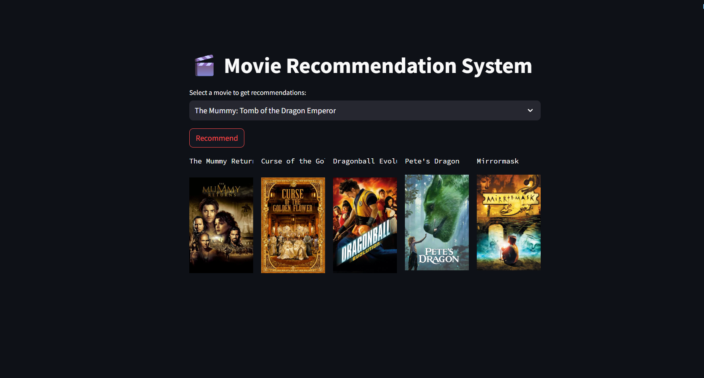
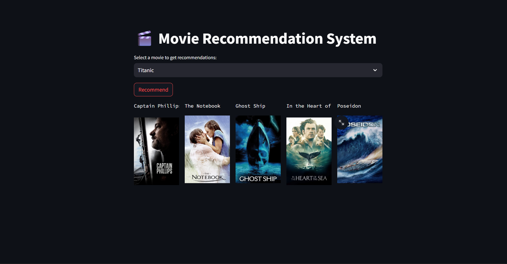
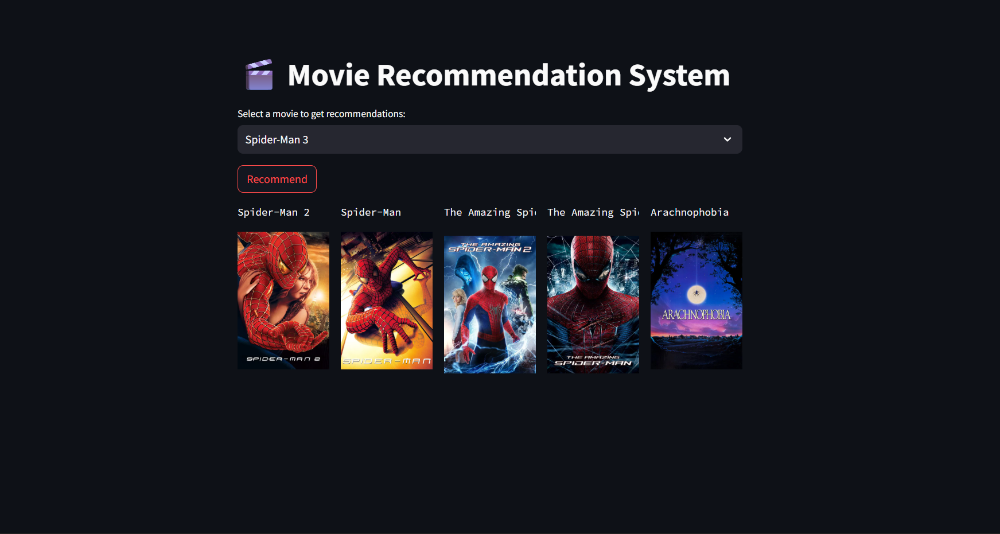

# Movie Recommender System Using Machine Learning
Recommendation systems  are like the friendly digital curators of the modern world — they sift through oceans of data to find what you might like next. They power everything from Netflix suggesting your next binge-worthy show, to Spotify crafting a daily playlist, to Amazon nudging you toward your next impulsive purchase.At their core, recommendation systems predict a user’s preference for an item.

The purpose of a recommendation system basically is to search for content that would be interesting to an individual. Moreover, it involves a number of factors to create personalised lists of useful and interesting content specific to each user/individual. Recommendation systems are Artificial Intelligence based algorithms that skim through all possible options and create a customized list of items that are interesting and relevant to an individual. These results are based on their profile, search/browsing history, what other people with similar traits/demographics are watching, and how likely are you to watch those movies. This is achieved through predictive modeling and heuristics with the data available.
# Types of Recommendation System :
## 1 ) Content Based :
- Content-based systems, which use characteristic information and takes item attriubutes into consideration .

- Which music you are listening , what singer are you watching . Form embeddings for the features .

- User specific actions or similar items reccomendation .

- It will create a vector of it .

- These systems make recommendations using a user's item and profile features. They hypothesize that if a user was interested in an item in the past, they will once again be interested in it in the future

- One issue that arises is making obvious recommendations because of excessive specialization (user A is only interested in categories B, C, and D, and the system is not able to recommend items outside those categories, even though they could be interesting to them).
- Twitter , Youtube .

## 2 ) Collaborative Based :
- Collaborative filtering systems, which are based on user-item interactions.

- Clusters of users with same ratings , similar users .

- Book recommendation , so use cluster mechanism .

- We take only one parameter , ratings or comments .

- In short, collaborative filtering systems are based on the assumption that if a user likes item A and another user likes the same item A as well as another item, item B, the first user could also be interested in the second item .

- Issues are :

  - User-Item nXn matrix , so computationally expensive .

  - Only famous items will get reccomended .

  - New items might not get reccomended at all .

## 3 ) Hybrid Based :
- Hybrid systems, which combine both types of information with the aim of avoiding problems that are generated when working with just one kind.

- Combination of both and used now a days .

- Uses : word2vec , embedding .

# About This project
This is a streamlit web application that can recommend various kinds of similar movies based on an user interest.
# Demo






# DataSet Used :
[DatasetLink](https://www.kaggle.com/datasets/tmdb/tmdb-movie-metadata)
# Concept used : 
1. ## cosine_similarity :
  - Cosine similarity is a metric used to measure the similarity between two non-zero vectors in an inner product space by calculating the cosine of the angle between them.
  - In order to demonstrate cosine similarity function we need vectors. Here vectors are numpy array.
  - Finally, Once we have vectors, We can call cosine_similarity() by passing both vectors. It will calculate the cosine similarity between these two.
  - It will be a value between [0,1]. If it is 0 then both vectors are complete different. But in the place of that if it is 1, It will be completely similar.
# How to run : 
## STEP 01 : 
**clone the repository :** 
```
git clone https://github.com/MayukhBaruah19/Movie-Recomendation-System.git
```
## STEP 02 : 
**Create a conda environment :** 
```
conda create -p venv python=3.12 -y
```
**Activate the envirnment :**
```
conda activate venv
```
## STEP 03 : 
**install the requirements :**
```
pip install -r requirements.txt
```
## STEP 04 :
**Run the app.py file :**
```
streamlit run app.py
```
# Project Structure
```
.
├── README.md
├── app.py
├── data
│   ├── tmdb_5000_credits.csv
│   └── tmdb_5000_movies.csv
├── demo
│   ├── demo1.png
│   ├── demo2.png
│   ├── demo3.jpeg
│   └── demo4.png
├── movie_dict.pkl
├── movie_recomender_system.ipynb.ipynb
├── movies_list.pkl
├── requirements.txt
└── similarity.pkl
```
